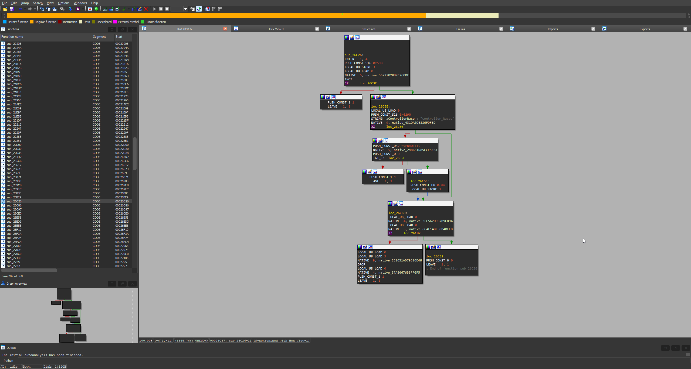

# ysc-ida
Hex-Rays IDA processor module & loader to dissassemble Grand Theft Auto V YSC scripts in IDA 7/8.
Requires a decompressed YSC file from GTA5.

## Usage
1. Put ysc.py into <IDA_DIR>/procs/
2. Put ysc_loader.py into <IDA_DIR>/loaders/
3. Export a ysc.full file using a tool such as OpenIV, and import it into IDA. Select YSC Loader from the list.
## Requirements
- Python 3.x
- IDA 7/8 (tested on 8.2)
